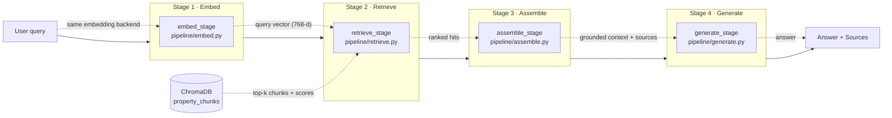

# IntelliHomes RAG Architecture — Query-to-Answer Flow

This document describes the end-to-end **query-to-answer** retrieval-augmented
generation (RAG) flow: how a user query becomes a grounded answer together
with the sources that support it.

The pipeline lives in `backend/pipeline/` and is orchestrated by
`pipeline.runner.run_pipeline(query, k=3)`. Each stage is a small,
independently testable function; the runner only wires them together.

## Flow diagram



## Stage-by-stage description

### Stage 1 — Embed (`pipeline/embed.py` → `embed_stage`)

The raw query is embedded into the **same vector space** as the indexed
document chunks. The embedding backend (mode, model, dimension) is read from
the embeddings store header (`data/embeddings/<corpus>-embeddings.json`), so
a live-indexed store never gets simulated query vectors and vice versa.

**Output:** `{query, vector (768-d), mode, model, dim, stats}`

### Stage 2 — Retrieve (`pipeline/retrieve.py` → `retrieve_stage`)

The stage-1 vector is searched against the ChromaDB collection
(`chroma_db`, collection `property_chunks`, cosine space). Because the vector
is passed in, the query is embedded **exactly once** per pipeline run
(`retrieval/vector_search.search` accepts an optional pre-computed `vector`).
Supports optional metadata filters (source/category) and hybrid
vector + keyword re-ranking for exact IDs and names.

**Output:** top-`k` chunks, each with `{id, text, metadata, distance, score}`
(score = `1 − cosine_distance`; `k` clamped to the collection).

### Stage 3 — Assemble (`pipeline/assemble.py` → `assemble_stage`)

The ranked hits become:

1. a **numbered, grounded context block** injected into the generation
   prompt, each chunk labelled with its source document, section and score:

   ```
   [1] property_guide.txt — Section 1 — score 0.546
   Buying property requires verifying ownership documents.

   [2] ownership.txt — Section 1 — score 0.442
   Property ownership should always be verified before purchase.
   ```

2. a **structured sources list** (`{id, source, section, position, category,
   score, text}` in rank order) so the UI can show *where* the answer came
   from.

An optional `max_context_tokens` cap drops whole chunks from the lowest-ranked
end until the block fits the model's window.

**Output:** `{context, sources, context_tokens, truncated, hit_count}`

### Stage 4 — Generate (`pipeline/generate.py` → `generate_stage`)

The grounded context is rendered into the IntelliHomes prompt templates
(`prompts/templates.py` via `prompts/renderer.render_prompt`) and sent to an
LLM:

- **live** — any OpenAI-compatible chat-completions endpoint (Ollama by
  default, or OpenAI) when `OPENAI_API_KEY` is set;
- **simulated** — a deterministic offline responder, so the pipeline still
  runs end to end for demos and tests.

The LLM is pluggable: `generate_stage(..., llm=callable)` accepts any
`llm(messages) -> str`.

**Output:** `{answer, model, live, system_prompt, user_prompt, prompt_tokens}`

### Returned sources

The pipeline result carries the sources alongside the answer:

| Key | Contents |
| --- | --- |
| `query` | the user question |
| `embedding` | stage 1 output (mode/model/dim) |
| `retrieval` | stage 2 output (top-k chunks + scores) |
| `context` | stage 3 output (context block + **sources**) |
| `answer` | stage 4 output (answer, model, prompts) |
| `timings_ms` | per-stage wall-clock time |

## Running it

```bash
cd backend

# End to end (simulated embedding + simulated generation by default)
uv run python scripts/run_pipeline.py

# Live generation against Ollama/OpenAI (set OPENAI_API_KEY)
uv run python scripts/run_pipeline.py "Does a title deed prove ownership?"

# Tests
uv run pytest tests/test_pipeline.py
```

Sample output (committed): `backend/pipeline_sample_output.txt`.

## Configuration

| Variable | Default | Used by |
| --- | --- | --- |
| `SAMPLE_QUERY` | "What document proves legal ownership…" | demo script |
| `PIPELINE_K` | `3` | demo script |
| `PIPELINE_OUTPUT` | `pipeline_sample_output.txt` | demo script |
| `EMBEDDINGS_STORE` | `../data/embeddings/cleaned_corpus-embeddings.json` | embed |
| `EMBEDDING_MODEL` | `nomic-embed-text` | embed |
| `CHROMA_PATH` / `COLLECTION_NAME` | `chroma_db` / `property_chunks` | retrieve |
| `OPENAI_API_KEY` / `OPENAI_BASE_URL` / `OPENAI_MODEL` | Ollama `llama3.1:8b` | generate (live) |

## Module map

| Stage | Module | Function |
| --- | --- | --- |
| 1 · Embed | `pipeline/embed.py` | `embed_stage` |
| 2 · Retrieve | `pipeline/retrieve.py` | `retrieve_stage` |
| 3 · Assemble | `pipeline/assemble.py` | `assemble_stage` |
| 4 · Generate | `pipeline/generate.py` | `generate_stage`, `make_llm` |
| Orchestration | `pipeline/runner.py` | `run_pipeline` |
| Demo | `scripts/run_pipeline.py` | `main` |
| Tests | `tests/test_pipeline.py` | — |
